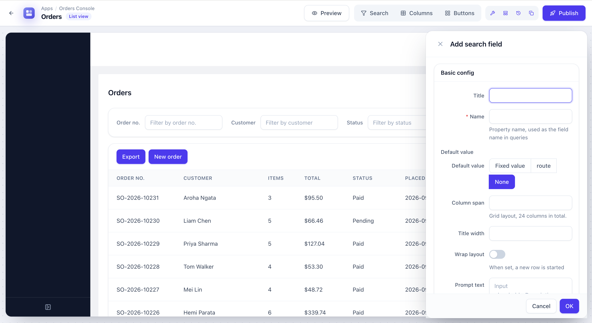
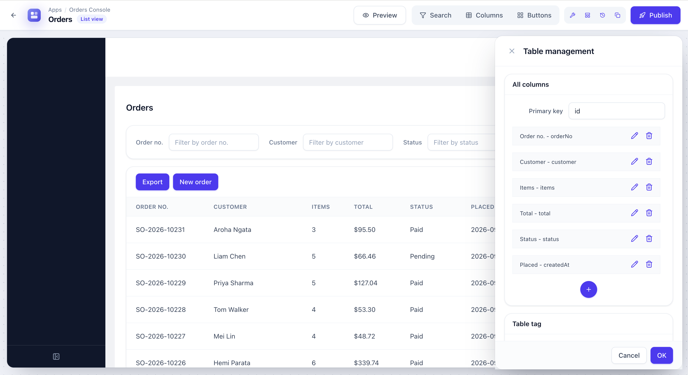

# lowcode

A low-code platform for building admin systems: design pages visually, save them as schemas, and render them at runtime.

## Screenshots

Adding a search field in the page designer:



Managing table columns:



## Getting started

Requires Node 22. The server runs on <http://localhost:8080>.

```bash
npm install
npm start        # API + webpack dev server
npm run dev:web  # frontend only: no database or backend API
npm run mock     # like start, but always use the local mock config
npm run build    # typecheck, then build API and web into dist/
npm run lint     # also: typecheck, lint:fix
```

Configuration comes from environment variables: `DB_URL`, `DB_USER`, `DB_PASSWORD` (database), `NACOS_URL` (config server, default `localhost:8848`), `RUN_ENV`, `CORS_ALLOW_DOMAIN`, `PROXY_TARGET`.

In development, if `NACOS_URL` is not set, the API loads its config from `src/api/lowcode-api/config/mock.ts` instead of Nacos, so `npm start` works offline.

Uploaded files and published apps are stored under `appdata/` (for example `appdata/lowcode/webapps/<code>/`), and uploads are served from `/resources`.

## Deploy

`npm run build`, then build the `dockerfile`. The container runs the API with `node` on port 8080, with a health check at `/health/check`. Supply the environment variables at runtime.

## Layout

| Path | Contents |
| --- | --- |
| `src/api/lowcode-api` | Backend: entry, controllers, `config`, `framework`, `models` |
| `src/web/lowcode` | Admin pages and layouts |
| `src/web/lowcode-core` | Page designer and schema runtime |
| `src/web/lowcode-ui`, `lowcode-registry` | Designer widgets and their registry |
| `src/web/lowcode-services`, `lowcode-configs` | API clients, constants (the rematch store lives in `lowcode-core/provider`) |
| `packages/lowcode-kit` | Tailwind + Radix component kit used by the studio, designer and generated apps |
| `packages/lowcode-blocks` | Config-driven table/form/action building blocks |
| `packages/lowcode-common` | HTTP client, OSS/URL helpers |
| `packages/lowcode-server` | Decorator-based HTTP server on Express (`@Controller`, `@Post`, `@Body`, `createServer`) |
| `packages/lowcode-dev-proxy` | Dev-server middleware: forwards to `PROXY_TARGET` or serves `mock/*.json` |
| `packages/lowcode-webpack-plugin` | Webpack plugin for sub-app component bundles (also re-exported as `lowcode-registry/webpack`) |

All dependencies install from public npm.

## License

[MIT](LICENSE) © 2026 ttang1024
